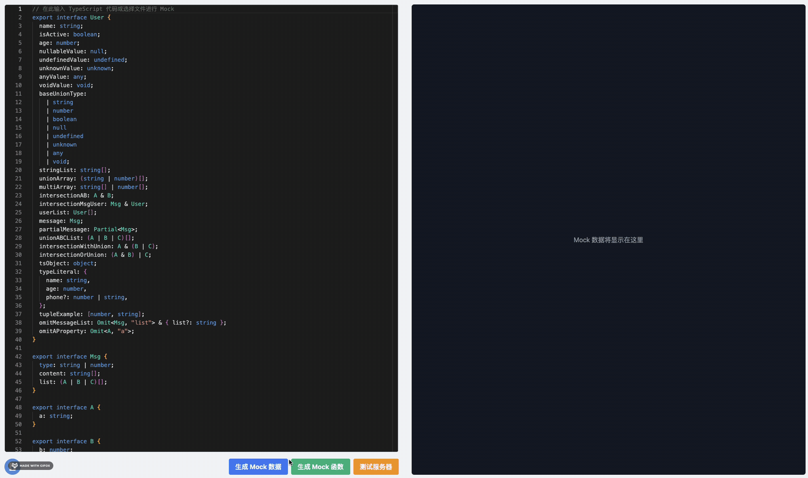

# ts-to-mock

[English](./README.md) | 简体中文

ts-to-mock 是一个 TypeScript 接口解析项目，用于生成 Mock 数据和 Mock 函数。

## 演示



## 功能

- 解析 TypeScript 接口
- 生成 Mock 数据
- 生成 Mock 函数
- 提供客户端界面进行交互
- 支持服务器端处理

## 安装

本项目仅支持使用 pnpm 进行包管理。

1. 确保已安装 pnpm。如果尚未安装，请运行：

```**bash**
npm install -g pnpm
```

2. 克隆项目仓库：

```bash
git clone [项目仓库URL]
cd ts-to-mock
```

2. 安装依赖：
   
```bash
pnpm install-all
```

## 使用

启动开发服务器：

```bash
pnpm dev
```

这将同时启动客户端和服务器端的开发服务器。

## 项目结构

项目采用 monorepo 结构，包含以下包：

- packages/client: 客户端应用
- packages/server: 服务器端应用

## 脚本

- pnpm dev: 启动所有包的开发服务器
- pnpm build: 构建所有包
- pnpm test: 运行所有包的测试
- pnpm install-all: 安装所有包的依赖